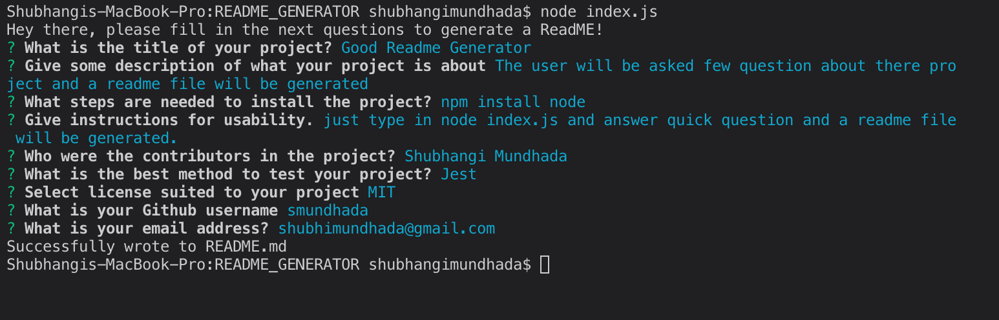

# Good Readme Generator
---

## Table of Contents
---
* [Description](#Description)
* [Installation](#Installation)
* [Usage](#Usage)
* [Contributors](#Contributors)
* [Test](#Test)
* [License](#License)
* [Questions](#Questions)

## Description
---
The user will be asked few question about there project and a readme file will be generated

## Installation 
---
npm install node 

## Usage 
---
just type in node index.js and answer quick question and a readme file will be generated. 

## Contributors
---
Shubhangi Mundhada

## Test
---
Jest

## License
---
MIT

## Questions
---
Github Link - https://github.com/smundhada
Email - shubhimundhada@gmail.com

